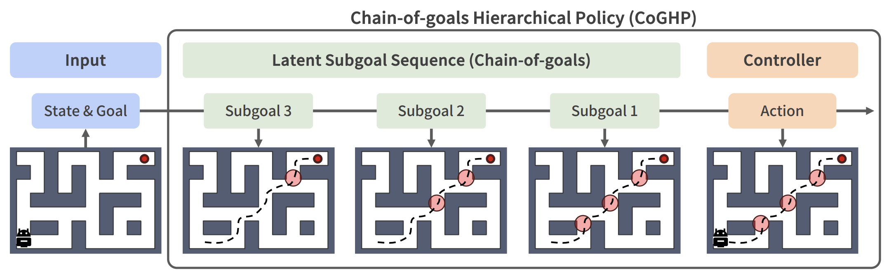

<div align="center">

# Chain-of-Goals Hierarchical Policy for Long-Horizon Offline Goal-Conditioned RL

## [Paper](https://arxiv.org/abs/2602.03389) / [Project Page](https://wlsdn9350.github.io/projects/coghp/)



</div>

# Overview
**CoGHP** is a unified hierarchical policy for long-horizon offline goal-conditioned reinforcement learning. It generates a **chain-of-goals**, a sequence of latent subgoals followed by the primitive action, using an autoregressive policy. This formulation enables the agent to decompose long-horizon tasks into intermediate steps while maintaining awareness of the final goal.

# Installation
CoGHP implementations require Python 3.9+ and additional dependencies, including `jax >= 0.4.26`.
To install these dependencies, run:

```shell
cd impls
pip install -r requirements.txt
```

# Reproducing the main results
An agent can be trained by executing `main.py` script.

Commends:
```shell
# pointmaze-medium-navigate-v0
python main.py --env_name=pointmaze-medium-navigate-v0 --eval_episodes=50 --agent=agents/coghp.py
# pointmaze-large-navigate-v0
python main.py --env_name=pointmaze-large-navigate-v0 --eval_episodes=50 --agent=agents/coghp.py --agent.num_subgoals=1 --agent.subgoal_steps=50
# pointmaze-giant-navigate-v0
python main.py --env_name=pointmaze-giant-navigate-v0 --eval_episodes=50 --agent=agents/coghp.py --agent.num_subgoals=3 --agent.subgoal_steps=50 --agent.feature_dim=32 --agent.lr=1e-5

# antmaze-medium-navigate-v0
python main.py --env_name=antmaze-medium-navigate-v0 --eval_episodes=50 --agent=agents/coghp.py
# antmaze-large-navigate-v0    
python main.py --env_name=antmaze-large-navigate-v0 --eval_episodes=50 --agent=agents/coghp.py --agent.num_subgoals=1 --agent.subgoal_steps=50 --agent.feature_dim=128
# antmaze-giant-navigate-v0
python main.py --env_name=antmaze-giant-navigate-v0 --eval_episodes=50 --agent=agents/coghp.py --agent.num_subgoals=2 --agent.subgoal_steps=50 --agent.feature_dim=128

# cube-single-noisy-v0
python main.py --env_name=cube-single-noisy-v0 --eval_episodes=50 --agent=agents/coghp.py --agent.subgoal_steps=10 --agent.num_subgoals=1 --agent.gc_enc=None --agent.feature_dim=32
# cube-double-noisy-v0
python main.py --env_name=cube-double-noisy-v0 --eval_episodes=50 --agent=agents/coghp.py --agent.subgoal_steps=10 --agent.num_subgoals=1 --agent.gc_enc=None --agent.feature_dim=128 --agent.lr=3e-5
# cube-triple-noisy-v0
python main.py --env_name=cube-triple-noisy-v0 --eval_episodes=50 --agent=agents/coghp.py --agent.subgoal_steps=10 --agent.num_subgoals=1 --agent.gc_enc=None --agent.feature_dim=256 --agent.lr=3e-5

# scene-play-v0
python main.py --env_name=scene-play-v0 --eval_episodes=50 --agent=agents/coghp.py --agent.subgoal_steps=10 --agent.num_subgoals=1 --agent.gc_enc=None --agent.feature_dim=256

# visual-antmaze-medium-navigate-v0
python main.py --env_name=visual-antmaze-medium-navigate-v0 --train_steps=500000 --eval_episodes=50 --agent=agents/coghp.py --agent.encoder=impala_small --agent.high_alpha=3.0 --agent.low_actor_rep_grad=True --agent.low_alpha=3.0
# visual-cube-single-noisy-v0
python main.py --env_name=visual-cube-single-noisy-v0 --train_steps=500000 --eval_episodes=50 --eval_on_cpu=0 --agent=agents/coghp.py --agent.encoder=impala_small --agent.high_alpha=3.0 --agent.low_actor_rep_grad=True --agent.low_alpha=3.0 --agent.p_aug=0.5 --agent.feature_dim=32 --agent.subgoal_steps=10
```

# Acknowledgments
This code is based on [OGBench](https://github.com/seohongpark/ogbench) repository.

# Citation
```shell
@article{choi2026chain,
  title={Chain-of-Goals Hierarchical Policy for Long-Horizon Offline Goal-Conditioned RL},
  author={Choi, Jinwoo and Lee, Sang-Hyun and Seo, Seung-Woo},
  journal={arXiv preprint arXiv:2602.03389},
  year={2026}
}
```
